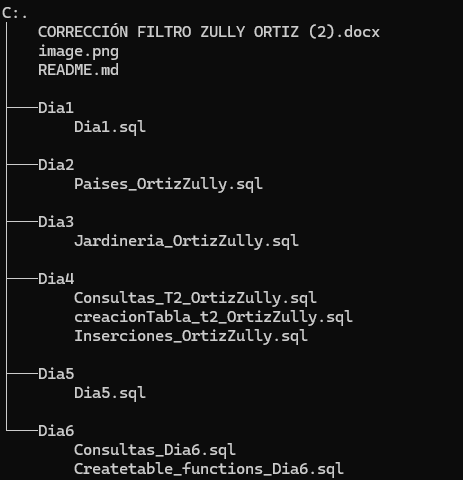

# MYSQL 

En este repositorio consta de las evidencias de aprendiaje de dia a dia de MySQL donde cada dia tiene su temario 

## DESCRIPCIÓN

* **Dia1** :
    - Creacion de base de datos y  tablas en MySQL.

        ```sql
        CREATE DATABASE migrupoT2; -- Crear una base de datos

        USE migrupoT2; -- Utilizar mi BBDD

        CREATE TABLE Libros( -- Creacion de la tabla libros
            id_libros INT NOT NULL AUTO_INCREMENT PRIMARY KEY, -- LLave primaria
            autores VARCHAR(255) NOT NULL,
            titulo VARCHAR(255) NOT NULL,
            ISBN INT NOT NULL,
            categoria VARCHAR(255) NOT NULL,
            fecha_publicacion INT NOT NULL,
            stock INT NOT NULL
            );

        CREATE TABLE Autores(
            id_autores  INT NOT NULL AUTO_INCREMENT PRIMARY KEY,
            nombre VARCHAR(255) NOT NULL,
            nacionalidad VARCHAR(255) NOT NULL,
            fecha_nacimiento VARCHAR(255) NOT NULL,
            FOREIGN KEY(id_libros) REFERENCES Libros(id_libros) -- LLave foranea
            );
        CREATE TABLE Pedidos(
            id_pedidos INT NOT NULL AUTO_INCREMENT PRIMARY KEY,
            estado_pedido VARCHAR(255) NOT NULL,
            fecha_compra INT NOT NULL,
            cantidad_stock INT NOT NULL
            );
        CREATE TABLE clientes(
            id_clientes INT NOT NULL AUTO_INCREMENT PRIMARY KEY,
            nombre VARCHAR(255) NOT NULL,
            direccion VARCHAR(255) NOT NULL,
            telefono INT NOT NULL,
            correo_electronico VARCHAR(500) NOT NULL
            );
        CREATE TABLE Transacciones(
            id_transiccion INT NOT NULL AUTO_INCREMENT PRIMARY KEY,
            fecha_transaccion INT NOT NULL,
            metodo_de_pago VARCHAR(255) NOT NULL,
            monto_total INT NOT NULL
            );

        ```

* **Dia2** :

    - Se evidecia la creacion de base de dato y tablas donde cada tabla se le inserto informacion y se realizo una consultas y subconsultas basicas.

    1. Creación de base de datos y tablas:

        ```sql
            CREATE DATABASE migrupoT2_pais; -- Crear una base de datos

            USE migrupoT2_pais; -- Utilizr mi BBSS

            CREATE TABLE Pais (
                id_pais int primary key not null,
                nombre varchar(20) not null,
                continente varchar(50) not null,
                poblacion int not null
            ); -- Creación Tabla País

            CREATE TABLE Ciudad (
                id int primary key not null,
                nombre varchar(45) not null,
                id_pais int not null,
                foreign key(id_pais) references Pais(id_pais)
            ); -- Creación tabla Ciudad
                
            CREATE TABLE Idioma(
                id int primary key not null,
                idioma varchar(50)
            );

            CREATE TABLE idioma_pais(
                id_idioma int not null,
                id_pais int not null,
                es_oficial tinyint,
                primary key (id_idioma,id_pais),
                foreign key (id_idioma) references Idioma(id),
                foreign key (id_pais) references Pais(id_pais)
            );

        ```

    2. Insercción de datos en las tabla de datos: 

        ```sql
            insert into Idioma (id,idioma) values (1,'Español');
            insert into Idioma (id,idioma) values (2,'Ingles'),(3, 'Francés');

            insert into Pais (id_pais,nombre,continente,poblacion)
            values (1, 'México', 'América', 126000000),
            (2, 'Estados Unidos', 'América', 331000000),
            (3, 'Francia', 'Europa', 67000000),
            (4, 'Canadá', 'América', 38000000);
            -- Español es el lenguaje oficial de México
            insert into idioma_pais (id_idioma,id_pais,es_oficial) values (1,1,1);
            -- Ingles no es el leguaje oficial de Mexico 
            insert into idioma_pais (id_idioma,id_pais,es_oficial) values (2,1,0);
            -- truncate table idioma_pais; -- Eliminar todos los datos de la tabla 
            -- drop tabla idioma_pais; -- Eliminar toda la tabla

            insert into idioma_pais(id_idioma,id_pais,es_oficial) values(2,2,1); -- Inglés es oficial en Estados Unidos
            insert into idioma_pais(id_idioma,id_pais,es_oficial) values(1,2,0); -- Español no es oficial en Estados Unidos
            insert into idioma_pais(id_idioma,id_pais,es_oficial) values(3,3,1); -- Francés es oficial en Francia
            insert into idioma_pais(id_idioma,id_pais,es_oficial) values(2,4,1); -- Inglés es oficial en Canadá
            insert into idioma_pais(id_idioma,id_pais,es_oficial) values(3,4,1); -- Francés es oficial en Canadá
        ```
        
    3. Realización de consultas y subconsultas básicas:

        ```sql
        -- 1. Listar todos los idiomas 
        select * from Idioma;
        select idioma from Idioma;
        -- 2. Listar el idioma con ID 1
        select * from Idioma where id=1;
        select idioma  from Idioma where id=1;
        -- 3. Consultar los pauses que esten en America
        select nombre from Pais where continente = 'América';
        select * from Pais where continente = 'América';
        select nombre as NombrePais from Pais where continente = 'América';

        -- SUBCONSULTAS 
        -- 4. Subconsulta que encuentre los idiomas oficiales 
        select idioma from Idioma where id in (select id_idioma from idioma_pais where es_oficial =1);

        ```

* **Dia3** :

    - Se evidencia ña creación de base de dato llamada Jardineria_OrtizZully donde contiene la creación de 8 tablas y la insecición de datos de las mismas con el desarrollo de consultas. 

* **Dia4** :

    - contiene tres carpetas: 

        1. *CreaciónTabla_T2_OrtizZully.sql*: 
        Contiene la creación de base de dato y la creación de 7 tablas: 

            ```sql
            
            CREATE DATABASE universidad_T2 CHARACTER SET utf8mb4;
            USE universidad_T2;
            
            CREATE TABLE departamento (
                id INT UNSIGNED AUTO_INCREMENT PRIMARY KEY,
                nombre VARCHAR(50) NOT NULL
            );

            CREATE TABLE alumno (
                id INT UNSIGNED AUTO_INCREMENT PRIMARY KEY,
                nif VARCHAR(9) UNIQUE,
                nombre VARCHAR(25) NOT NULL,
                apellido1 VARCHAR(50) NOT NULL,
                apellido2 VARCHAR(50),
                ciudad VARCHAR(25) NOT NULL,
                direccion VARCHAR(50) NOT NULL,
                telefono VARCHAR(9),
                fecha_nacimiento DATE NOT NULL,
                sexo ENUM('H', 'M') NOT NULL
            );
            
            CREATE TABLE profesor (
                id INT UNSIGNED AUTO_INCREMENT PRIMARY KEY,
                nif VARCHAR(9) UNIQUE,
                nombre VARCHAR(25) NOT NULL,
                apellido1 VARCHAR(50) NOT NULL,
                apellido2 VARCHAR(50),
                ciudad VARCHAR(25) NOT NULL,
                direccion VARCHAR(50) NOT NULL,
                telefono VARCHAR(9),
                fecha_nacimiento DATE NOT NULL,
                sexo ENUM('H', 'M') NOT NULL,
                id_departamento INT UNSIGNED NOT NULL,
                FOREIGN KEY (id_departamento) REFERENCES departamento(id)
            );
            
            CREATE TABLE grado (
                id INT UNSIGNED AUTO_INCREMENT PRIMARY KEY,
                nombre VARCHAR(100) NOT NULL
            );
            
            CREATE TABLE asignatura (
                id INT UNSIGNED AUTO_INCREMENT PRIMARY KEY,
                nombre VARCHAR(100) NOT NULL,
                creditos FLOAT UNSIGNED NOT NULL,
                tipo ENUM('básica', 'obligatoria', 'optativa') NOT NULL,
                curso TINYINT UNSIGNED NOT NULL,
                cuatrimestre TINYINT UNSIGNED NOT NULL,
                id_profesor INT UNSIGNED,
                id_grado INT UNSIGNED NOT NULL,
                FOREIGN KEY(id_profesor) REFERENCES profesor(id),
                FOREIGN KEY(id_grado) REFERENCES grado(id)
            );
            
            CREATE TABLE curso_escolar (
                id INT UNSIGNED AUTO_INCREMENT PRIMARY KEY,
                anyo_inicio YEAR NOT NULL,
                anyo_fin YEAR NOT NULL
            );

            CREATE TABLE alumno_se_matricula_asignatura (
                id_alumno INT UNSIGNED NOT NULL,
                id_asignatura INT UNSIGNED NOT NULL,
                id_curso_escolar INT UNSIGNED NOT NULL,
                PRIMARY KEY (id_alumno, id_asignatura, id_curso_escolar),
                FOREIGN KEY (id_alumno) REFERENCES alumno(id),
                FOREIGN KEY (id_asignatura) REFERENCES asignatura(id),
                FOREIGN KEY (id_curso_escolar) REFERENCES curso_escolar(id)
            );

            ```

        2. *Insercciones_OrtizZully.sql*:
        Contiene las insercciones de la tablas creadas anteriormente .

        3. *Consultas_T2_OrtizZully.sql*:
        Contiene la realización de 14 consultas.

* **Dia5** :

    - Contiene consultas adicionales del la data base Universidad_T2:

    ```sql
        USE universidad_T2;

        -- 1. Devuelve todos los datos del alumno más joven.

        select * from alumno where alumno.fecha_nacimiento = (select max(fecha_nacimiento) from alumno);

        -- 2. Devuelve un listado con los profesores que no están asociados a un departamento.

        select * from profesor where id_departamento = NULL;

        -- 3. Devuelve un listado con los departamentos que no tienen profesores asociados.

        select depar.nombre from departamento depar where depar.id not in (select distinct profe.id_departamento from profesor profe);

        -- 4.  Devuelve un listado con los profesores que tienen un departamento asociado y que no imparten ninguna asignatura.

        select profesor.* from profesor
        left join asignatura asig on asig.id_profesor = profesor.id where asig.id_profesor is NULL;

        -- 5.  Devuelve un listado con las asignaturas que no tienen un profesor asignado.

        select * from asignatura where id_profesor is NULL;

        -- 6. Devuelve un listado con todos los departamentos que no han impartido asignaturas en ningún curso escolar.

        SELECT departamento.nombre, asignatura.nombre FROM departamento
        LEFT JOIN profesor ON departamento.id = profesor.id_departamento
        INNER JOIN asignatura ON profesor.id = asignatura.id_profesor 
        LEFT JOIN alumno_se_matricula_asignatura asma ON asignatura.id = asma.id_asignatura
        LEFT JOIN curso_escolar ON asma.id_curso_escolar != curso_escolar.id;


        -- 7. Devuelve un listado con el nombre de todos los departamentos que tienen profesores que imparten alguna asignatura en el Grado en Ingeniería Informática (Plan 2015).

        select distinct depar.* from departamento depar
        inner join profesor profe on  profe.id = depar.id
        inner join asignatura asig on asig.id = profe.id;

        -- 8.  Devuelve un listado con los nombres de todos los profesores y los departamentos que tienen vinculados. El listado también debe mostrar aquellos profesores que no tienen ningún departamento asociado. 
        -- El listado debe devolver cuatro columnas, nombre del departamento, primer apellido, segundo apellido y nombre del profesor. El resultado estará ordenado alfabéticamente de menor a mayor por el nombre 
        -- del departamento, apellidos y el nombre.

        select depar.nombre as nombre_departamento, profe.apellido1, profe.apellido2, profe.nombre as nombre_profesor from profesor profe
        inner join departamento depar on profe.id_departamento = depar.id order by nombre_departamento, profe.apellido1, profe.apellido2, profe.nombre ASC;


        -- 9. Devuelve un listado con todos los departamentos que tienen alguna asignatura que no se haya impartido en ningún curso escolar.
        -- resultado debe mostrar el nombre del departamento y el nombre de la asignatura que no se haya impartido nunca.

        SELECT  departamento.nombre, asignatura.nombre FROM departamento LEFT JOIN profesor ON departamento.id = profesor.id_departamento
        INNER JOIN asignatura ON profesor.id = asignatura.id_profesor LEFT JOIN alumno_se_matricula_asignatura asma ON asignatura.id = asma.id_asignatura
        LEFT JOIN curso_escolar ON asma.id_curso_escolar != curso_escolar.id;
    ```

* **Dia5** :

    - Contiene dos carpetas:

        1. *Createtable_functions_Dia6.sql*:

        Evidencia creación de dato de base con la creacion de tablas e inserccion de datos con la elaboracion de funciones.

        2. *Consultas_Dia6.sql*:

        Contiene 63 consultas terminadas. 

* **CORRECCIÓN FILTRO ZULLY ORTIZ**:

Contiene el documento de word detallada de la estructura del filtro con la parte logica, fisica y conceptual.

## Estructura



## Lenguaje usado:


## Creditos

Este repositorio fue creado por Zully Fernanda Ortiz Avendaño CC. 1092528097